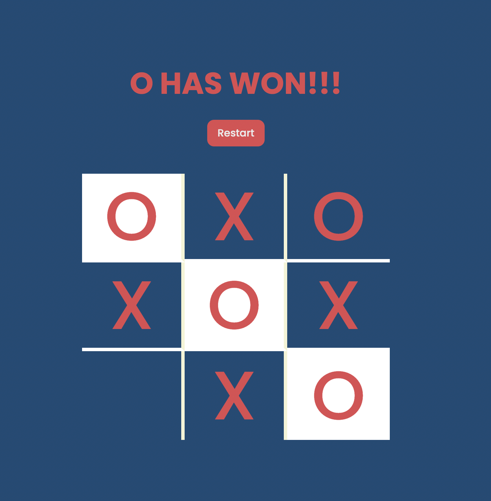

# Simple TIC-TAC-TOE Game

This is a fully responsive simple tic-tac-toe game written in HTML, CSS, and JavaScript.

**LIVE DEMO** - https://saurabhmhatre45.github.io/TIC-TAC-TOE/ OR https://tic-tac-toe-saurabh.netlify.app/

    
    
    
    
    

    

## Table of Contents

- [Design](#design) - [Fonts](#fonts)
- [Color Scheme](#color-scheme)
- [Built With](#built-with)
- [Contributing](#contributing)
- [Creator / Maintainer](#creator--maintainer)

---

## Design

### Fonts

[Nunito](https://fonts.googleapis.com/css2?family=Poppins:wght@300;500;700&display=swap) - this font is used for everything because it looks good in titles and the 'X' and 'O' in the game

### Color Scheme

- RED AND WHITE - Restart button
- RED - Player X text and tile color
- Blood Red - Player O text and tile color
- DARK BLUE - website background color

---

## Built With

- [HTML5](https://www.w3schools.com/html/)
- [CSS3](https://www.w3schools.com/css/)
- [JavaScript](https://www.w3schools.com/js/DEFAULT.asp)
- Hosted on [Netlify](https://www.netlify.com/)

---

## Contributing

Pull requests are welcome. For major changes, please open an issue first to discuss what you would like to change. Please make sure to update tests as appropriate.

### How To Contribute

1. Fork the repository to your own Github account.
2. Clone the project to your machine.
3. Create a branch locally with a succinct but descriptive name.
4. Commit changes to the branch.
5. Following any formatting and testing guidelines specific to this repo.
6. Push changes to your fork.
7. Open a Pull Request in my repository.

---

### Creator / Maintainer

SAURABH MHATRE  (https://github.com/saurabhmhatre45)

If you have any questions, comments, or concerns, feel free to contact me below.

  

This project was created for educational purposes and for personal and open-source use.

If you like my content or find this code useful,Follow Me

